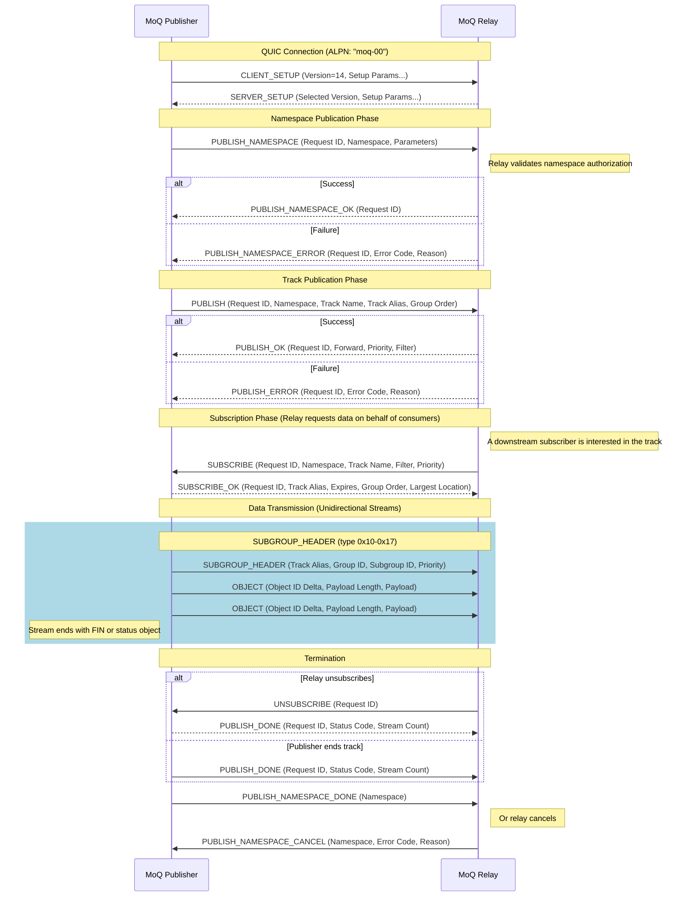

# Publish Sequence

The publish sequence in the MoQ protocol involves a series of message exchanges between a publisher and the MoQ relay to establish a publishing session and transmit media data. Below is a detailed description of the publish sequence per draft-ietf-moq-transport-14.

## Message Flow Description

1. **Connection Setup**: The publisher initiates a QUIC connection with the relay using the `CLIENT_SETUP` message containing:
   - Supported versions array
   - Setup parameters (path, max_subscribe_id, etc.)

   The relay responds with `SERVER_SETUP` containing:
   - Selected version
   - Server parameters

2. **Namespace Publication Phase**:
   - Publisher sends `PUBLISH_NAMESPACE` to declare intent to publish tracks under a namespace:
     - **Request ID**: Unique identifier (even for client-initiated)
     - **Track Namespace**: Tuple of namespace components
     - **Parameters**: Auth tokens, delivery timeout, etc.
   - Relay validates authorization and responds with:
     - `PUBLISH_NAMESPACE_OK` on success
     - `PUBLISH_NAMESPACE_ERROR` on failure with error code

3. **Track Publication Phase**:
   - Publisher sends `PUBLISH` to announce a specific track:
     - **Request ID**: Unique identifier
     - **Track Namespace/Name**: Full track identification
     - **Track Alias**: Short identifier for data streams
     - **Group Order**: Ascending (0x1) or Descending (0x2)
     - **Content Exists**: Whether objects have been published
     - **Largest Location**: Current position if content exists
     - **Forward**: Whether to start sending immediately
   - Relay responds with:
     - `PUBLISH_OK`: Accepts with filter, priority, forward state
     - `PUBLISH_ERROR`: Rejects with error code

4. **Subscription Phase** (Relay-initiated):
   - When downstream consumers subscribe, relay forwards `SUBSCRIBE` to publisher
   - Publisher responds with `SUBSCRIBE_OK` containing:
     - **Track Alias**: For mapping data streams
     - **Expires**: Subscription timeout (ms)
     - **Group Order**: Actual delivery order
     - **Largest Location**: Current position

5. **Data Transmission**:
   - Publisher opens unidirectional streams for each subgroup
   - Each stream begins with `SUBGROUP_HEADER` (types 0x10-0x17):
     - Track Alias, Group ID, Subgroup ID, Publisher Priority
   - Objects follow with delta-encoded Object IDs:
     - Object ID Delta (from previous + 1)
     - Payload Length
     - Payload bytes
   - Stream ends with FIN or status object (endOfGroup, endOfTrack)

6. **Termination**:
   - **Relay unsubscribes**: Sends `UNSUBSCRIBE`, publisher replies with `PUBLISH_DONE`
   - **Publisher ends**: Sends `PUBLISH_DONE` with status and stream count
   - **Namespace cleanup**:
     - Publisher sends `PUBLISH_NAMESPACE_DONE` when done with namespace
     - Relay may send `PUBLISH_NAMESPACE_CANCEL` to stop subscriptions

## PUBLISH Message Fields

| Field | Type | Description |
|-------|------|-------------|
| Request ID | varint | Unique request identifier |
| Track Namespace | tuple | Namespace components |
| Track Name | bytes | Track name within namespace |
| Track Alias | varint | Short identifier for data streams |
| Group Order | 8-bit | 0x1=Ascending, 0x2=Descending |
| Content Exists | 8-bit | 0=no content, 1=has content |
| Largest Location | Location | Group/Object if content exists |
| Forward | 8-bit | 0=wait, 1=send immediately |
| Parameters | array | Key-value pairs |

## PUBLISH_ERROR Codes

| Code | Name | Description |
|------|------|-------------|
| 0x0 | INTERNAL_ERROR | Implementation-specific error |
| 0x1 | UNAUTHORIZED | Not authorized to publish |
| 0x2 | TIMEOUT | Authorization timeout |
| 0x3 | NOT_SUPPORTED | PUBLISH not supported |
| 0x4 | UNINTERESTED | Track not of interest |

## PUBLISH_NAMESPACE_ERROR Codes

| Code | Name | Description |
|------|------|-------------|
| 0x0 | INTERNAL_ERROR | Implementation-specific error |
| 0x1 | UNAUTHORIZED | Not authorized for namespace |
| 0x2 | TIMEOUT | Authorization timeout |
| 0x3 | NOT_SUPPORTED | PUBLISH_NAMESPACE not supported |
| 0x4 | UNINTERESTED | Namespace not of interest |
| 0x10 | MALFORMED_AUTH_TOKEN | Invalid auth token |
| 0x12 | EXPIRED_AUTH_TOKEN | Auth token expired |

## PUBLISH_DONE Status Codes

| Code | Name | Description |
|------|------|-------------|
| 0x0 | UNSUBSCRIBED | Subscriber unsubscribed |
| 0x1 | INTERNAL_ERROR | Publisher error |
| 0x2 | UNAUTHORIZED | Authorization failed |
| 0x3 | TRACK_ENDED | Track complete |
| 0x4 | SUBSCRIPTION_ENDED | Range completed |
| 0x5 | GOING_AWAY | Publisher migrating |
| 0x6 | EXPIRED | Subscription timed out |

## Notes

- Track Alias MUST be unique per session - reusing an alias for a different track is DUPLICATE_TRACK_ALIAS error
- Forward=0 in PUBLISH allows relay to prepare before receiving data
- Forward=1 allows publisher to start sending even before PUBLISH_OK
- PUBLISH_NAMESPACE must succeed before PUBLISH for tracks in that namespace
- Stream Count in PUBLISH_DONE helps subscriber verify all data received
- Publisher MUST NOT send PUBLISH_DONE until all streams are closed
- Objects outside the subscriber's filter range are not transmitted

## References

- [draft-ietf-moq-transport-14 Section 9.13-9.15, 9.23-9.27](https://datatracker.ietf.org/doc/draft-ietf-moq-transport/14/)
- [QUIC Protocol (RFC 9000)](https://www.rfc-editor.org/rfc/rfc9000.html)
