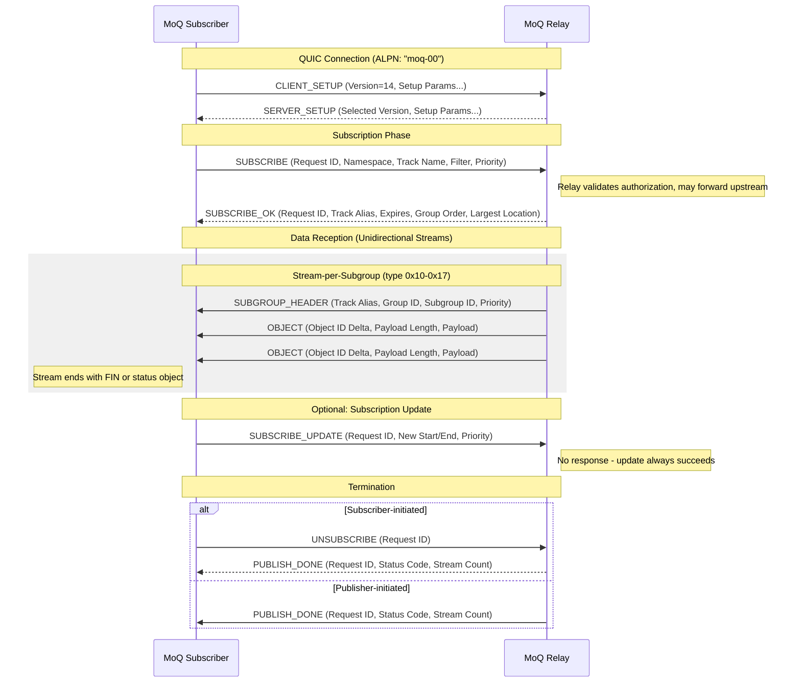

# Subscribe Sequence

The subscribe sequence in the MoQ protocol involves a series of message exchanges between a subscriber and the MoQ server (relay or original publisher) to establish a subscription and receive media data. Below is a detailed description of the subscribe sequence per draft-ietf-moq-transport-14.

## Message Flow Description

1. **Connection Setup**: The subscriber initiates a QUIC connection with the relay using the `CLIENT_SETUP` message, and the relay responds with `SERVER_SETUP` containing supported versions and parameters.

2. **Subscription Phase**:
   - The subscriber sends a `SUBSCRIBE` message specifying:
     - **Request ID**: Unique identifier (even numbers for client-initiated)
     - **Track Namespace/Name**: Identifies the desired track
     - **Filter Type**: One of:
       - `Largest Object (0x2)`: Start from current position
       - `Next Group Start (0x1)`: Start from next group
       - `AbsoluteStart (0x3)`: Start from specific location
       - `AbsoluteRange (0x4)`: Bounded range with end group
     - **Subscriber Priority**: 0-255 (lower = higher priority)
     - **Group Order**: Ascending (0x1), Descending (0x2), or Publisher's choice (0x0)
     - **Forward**: Whether to actually deliver objects (0 or 1)
   - The relay responds with `SUBSCRIBE_OK` containing:
     - **Track Alias**: Identifier for this track in data streams
     - **Expires**: Subscription timeout in milliseconds
     - **Group Order**: Actual delivery order
     - **Largest Location**: Current position if content exists

3. **Data Reception**:
   - Data arrives on unidirectional streams from the relay
   - Each stream begins with a `SUBGROUP_HEADER` containing:
     - Track Alias (to map to subscription)
     - Group ID and Subgroup ID
     - Publisher Priority
   - Objects follow with delta-encoded Object IDs and payloads
   - Stream ends with FIN or a status object (endOfGroup, endOfTrack)

4. **Subscription Update** (optional):
   - Subscriber sends `SUBSCRIBE_UPDATE` to narrow the range
   - Start Location can only increase, End Group can only decrease
   - No response message - update always succeeds

5. **Termination**:
   - **Subscriber-initiated**: Sends `UNSUBSCRIBE`, receives `PUBLISH_DONE`
   - **Publisher-initiated**: Receives `PUBLISH_DONE` when track ends

## Filter Types

| Filter | Value | Start Location | End Group |
|--------|-------|----------------|-----------|
| Next Group Start | 0x1 | {Largest.Group + 1, 0} | Open-ended |
| Largest Object | 0x2 | {Largest.Group, Largest.Object + 1} | Open-ended |
| AbsoluteStart | 0x3 | Specified in message | Open-ended |
| AbsoluteRange | 0x4 | Specified in message | Specified in message |

## SUBSCRIBE_ERROR Codes

| Code | Name | Description |
|------|------|-------------|
| 0x0 | INTERNAL_ERROR | Implementation-specific error |
| 0x1 | UNAUTHORIZED | Not authorized to subscribe |
| 0x2 | TIMEOUT | Upstream subscription timeout |
| 0x3 | NOT_SUPPORTED | SUBSCRIBE not supported |
| 0x4 | TRACK_DOES_NOT_EXIST | Track not available |
| 0x5 | INVALID_RANGE | Invalid start/end range |
| 0x10 | MALFORMED_AUTH_TOKEN | Invalid auth token |
| 0x12 | EXPIRED_AUTH_TOKEN | Auth token expired |

## PUBLISH_DONE Status Codes

| Code | Name | Description |
|------|------|-------------|
| 0x0 | UNSUBSCRIBED | Subscriber unsubscribed |
| 0x1 | INTERNAL_ERROR | Publisher error |
| 0x2 | UNAUTHORIZED | Authorization failed |
| 0x3 | TRACK_ENDED | Track complete |
| 0x4 | SUBSCRIPTION_ENDED | Range completed |
| 0x5 | GOING_AWAY | Publisher migrating |
| 0x6 | EXPIRED | Subscription timed out |

## Notes

- Objects with Locations outside the filter range are not delivered
- Track Alias maps data streams to subscriptions without full namespace/name
- `SUBSCRIBE_UPDATE` can only narrow, never widen, a subscription range
- For past objects, use `FETCH` instead of `SUBSCRIBE`
- The relay may cache objects and serve from cache if available
- `Forward=0` allows subscription setup without immediate data delivery

## References

- [draft-ietf-moq-transport-14 Section 9.7-9.12](https://datatracker.ietf.org/doc/draft-ietf-moq-transport/14/)
- [QUIC Protocol (RFC 9000)](https://www.rfc-editor.org/rfc/rfc9000.html)
